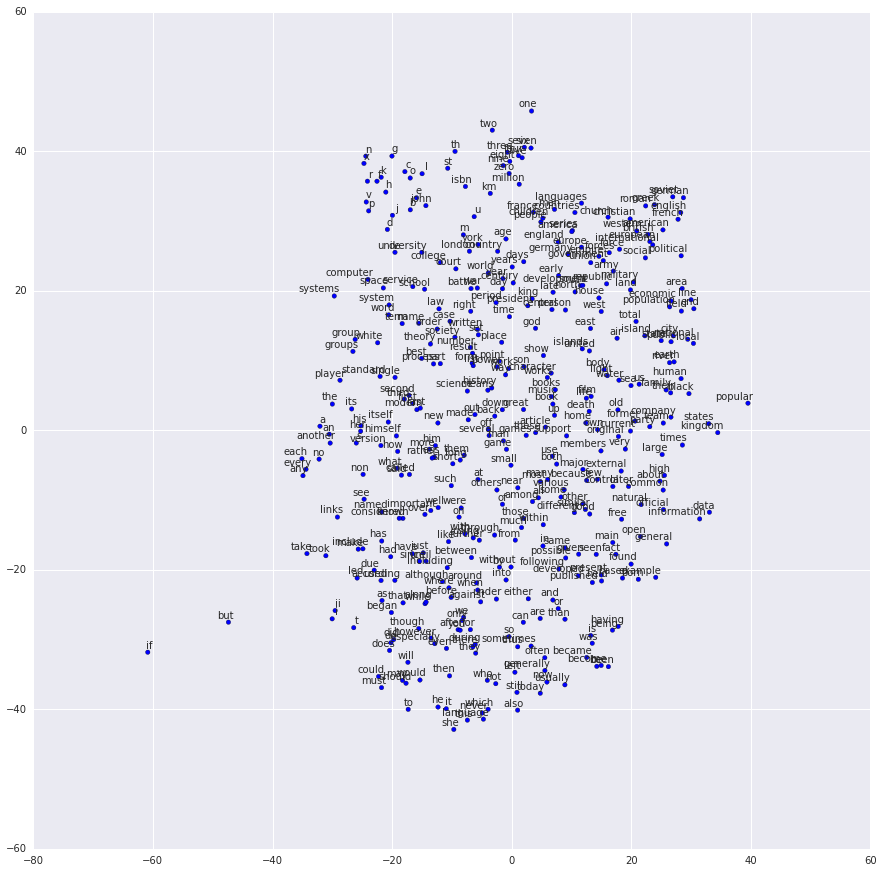

# NLP

`Natural language processing` Procesamiento de lenguajes naturales, es decir, el **NLP** es la parte de la inteligencia artificial que trabaja el lenguaje humano.

## Redes Neurales de Convolución para NLP

Las `RNC`, son ampliamente usadas para tareas de clasificación como detección de objetos en imágenes, animales, números, etc.

Pasos para `RNC`:

1. **Convolución**:
    - Creamos `detectores` de pequeñas `características` que recorrerán toda la imagen devolviéndonos una lista de todas las que tiene.

    - Dividimos imágenes en mini zonas que podrían ser píxeles por ejemplo, tratamos esto como matrices. Lo segmentaremos basándonos en las dimensiones de nuestro detector de características, por ejemplo un 3x3 píxeles, y se operarán con un `producto tensorial`, que consiste en tener un 3x3 de características que buscamos, y compararlo con todas las posibilidades de areas 3x3 de nuestra "gran imagen llena de píxeles"
    y multiplicamos cada índice con su relativo en el detector y sumamos cada producto.

    - Pongamos que tenemos una imagen de 6 x 6 píxeles, el `primer paso` será tomar el primer 3x3, aquel que va desde la posición `0 a la 2`, tanto `horizontal como verticalmente`, ese segmento lo `compararemos` con nuestro `detector de características` con un `producto tensorial` y añadiendo el resultado a nuestro mapa final, a la posición 0, 0 de la misma y, `a continuación`, `repetiremos` el proceso pero esta vez tomando el siguiente segmento, el que va de `1 a 3 en X`, y de `0 a 2 en Y`, como si fuera un `bucle anidado`.

    - `[[0, 0, 0], [0, 1, 0], [0, 0, 0]]` Esto es el segmento 3x3 que hemos tomado de la "gran imagen" (el 3x3 de la esquina superior izquierda por ejemplo), y `[[0, 0, 1], [1, 0, 0], [0, 1, 1]]` esto es nuestro detector, básicamente multiplicamos todos los índices con su relativo y sumamos los productos, y el resultado se coloca en una nueva matriz, en la posición (0, 0) de nuestro mapa de características que enviaremos al paso 2, y así en bucle, en este caso el producto tensorial da 0.

    - Por supuesto en situaciones reales tenemos muchísimos detectores de características que nos da muchísimos mapas de características.

    - Los detectores en el caso de las redes convolucionales se generan como matrices con números aleatorios y es trabajo de la propia red adaptarlos en su fase de entrenamiento, ya que al final la red puede comprobar como de precisas fueron sus predicciones y podrá ajustar sus detectores que hayan funcionado peor.

    - Imaginemos que nuestro mapa de características final tiene esta forma:

    - `[[0, 1, 0, 0, 0], [0, 1, 1, 1, 0], [1, 0, 0, 2, 1], [1, 4, 2, 1, 0], [0, 0, 1, 2, 1]]`

2. **Max Pooling**

    - Aplicamos funciones máximo a los mapas de características previamente obtenidas para reducirla y evitar un exceso de información, reduce el tamaño y el coste de computación del modelo global convirtiéndolo en más genérico.

    - Tomamos nuestro `mapa de características` del paso anterior, y vamos a tomar de nuevo `segmentos` esta vez `de 2x2` (por ejemplo dadas las dimensiones de nuestro mapa) y hacemos el mismo proceso de `bucle anidado` del paso anterior `pero` esta vez los segmentos no han de tener intersecciones entre ellos.

    - La función de máximo consiste en, de ese 2x2, tomar el número más grande.

    - Demostración con nuestro mapa de características del paso 1.
        1. Tomamos el primer 2x2 (de 0 a 1 en X, de 0 a 1 en Y): `[[0, 1], [0, 1]]`, y tomamos el máximo, en este caso `1`.

        2. Tomamos el siguiente 2x2 que no hayamos elegido en el paso anterior (de 2 a 3 en X, de 0 a 1 en Y): `[[0, 0], [1, 1]]`, tomamos el máximo, en este caso `1`.

        3. Siguiente 2x2 (de 4 a 5 en X, de 0 a 1 en Y): `[[0, null], [0, null]]`, el máximo en este caso es `0`.

            - Observamos como al tratarse de un 5x5 y elegir de 2 en 2, nos salimos del segmento, pero dado que solo queremos elegir el número más alto no importa.
        
        4. `Repetimos` el proceso de los 3 puntos anteriores pero `bajamos 2 en Y`.
    
    - Con esto hemos conseguido reducir nuestro mapa, haciéndolo más sencillo para computar por el ordenador y manteniendo lo importante y reduciendo información inútil (apenas hay 0).
    
    - Nuestro mapa de características (pooled) final será:

    - `[[1, 1, 0], [4, 2, 1], [0, 2, 1]]`

3. **Aplanado**

    - Tomamos esos mapas reducidos, que son mapas bidimensionales y los "aplanamos" para crear un super vector, para ello simplemente los `transformamos de matriz a vector vertical`.

    - `1, 1, 0, 4, 2, 1, 0, 2, 1` (imaginamos que está colocado verticalmente que si no no queda bien). Este será el `vector de entrada` de la `red neuronal`.

    - Obviamente tendremos muchísimos de estos vectores (uno por cada mapa de características), cada uno de los vectores resultantes se apilarán uno debajo del otro.

4. **Conexión completa**

    - Ese super vector será la entrada para nuestra red neuronal conectada.

    - Podemos añadir tantas capas ocultas como queramos, con tantas neuronas como queramos, estarán totalmente conectadas (por supuesto más capas ocultas y más neuronas = más tiempo de procesamiento).

    - En la entrada tendríamos nuestro vector aplanado del paso anterior y al otro extremo tendríamos nuestros valores de salida, y representan la probabilidad de que una imagen corresponda a dicha categoría.

    - Cada `valor de entrada` tiene una `flecha` a cada `neurona` de la capa oculta para relacionar, cada `flecha tiene un peso`, lo que hacemos es `multiplicar` el `peso` que tiene cada flecha que apunta a una neurona (que al otro extremo tiene un valor de entrada) por el `valor de entrada` (el valor de donde sale esa flecha), lo multiplicamos `en bucle` y al final `sumamos` todos esos `productos` y adjudicamos el `valor obtenido` a la `neurona` a la que dichas flechas apuntaban desde el principio.

    - Esta `relación` normalmente es `lineal`, y para que no lo sea, se activa una `función de activación` **RELU** que básicamente `detecta` si el resultado de esas sumas de productos para el cálculo de las neuronas `es negativo`, si lo es lo `reemplaza por un 0`, `si no` lo es `lo deja` como estaba. Con esto evitamos tener información negativa y nos quedamos solo con lo que realmente aporta.

---

## Imágenes a Texto

El modelo presentado anteriormente es muy útil para imágenes, encontrar patrones dentro de la misma para identificar y clasificar, pero en este caso queremos procesar texto.

Para ello podemos buscar patrones entre palabras de una frase, y para ello podemos `representar` dichas `palabras` de una `forma matricial` sobre la que la red neuronal buscará relaciones. Podemos `crear una matriz` y colocar cada `palabra en una row`, y transformando así cada `palabra en un vector de más o menos coordenadas`.

Una de las formas de `transformar palabras en vectores` en la conocida como `one-hot encoding`, que es igual de `sencilla` como `inútil`, ya que no hay relación entre palabras.

Consiste en tener un vocabulario (pongamos una lista de 100.000 palabras), y cada palabra corresponderá con una lista única de la misma length que la lista de vocabulario, en la que todos los elementos son 0 menos una posición en concreto que tendrá un 1, y esta será única para cada palabra.

- dog = [0, ..., 0, 1, 0, ..., 0]

Como se ve, `en ningún momento se establece una relación entre 2 palabras ni se justifica ningún tipo de orden`.

### Word Embedding

Buscaremos ahora una `representación numérica` de las `palabras` en un `vector más pequeño`, por ejemplo 64.

Esto permite que las `coordenadas` asociadas a cada palabra tendrán `menos números`, y la información estará `más restringidas` y `no` habrá tanta `libertad` para almacenar información libremente, `forzando` así al sistema `a crear relaciones` entre palabras.

- dog = [0.194, 0.047, ..., 0.126]

Pasa de ser binario a contener números decimales entre 0 y 1.

Estas relaciones se podrían sumar y restar usando sus vectores correspondientes:

- \[king] - \[man] + \[woman] = \[queen]
- \[Paris] - \[France] + \[Italia] = \[Rome]

Y como podemos observar en esta representación bidimensional de algunas palabras embebidas, palabras que están relacionadas han quedado cerca unas de otras.

La red tomará una serie de palabras de contexto que serán aquellas que en nuestra fase de entrenamiento estaban rodeando a nuestra palabra "clave"

"...people are really good at heart...", si tomamos "good" como nuestra palabra clave, la red tomará las palabras "are", "really", "at", "heart" como contexto para así establecer relaciones usando la `matriz de embedding` y la `matriz de contexto`.

Aplicamos `matriz de embedding` para reducir dimension, y aplicamos la `matriz de contexto` para reconstruirlo con sus palabras posiblemente relacionadas, dando como resultado números especialmente elevados cercanos a las palabras que podrían tener sentido junto con nuestra palabra "clave".

### Arquitectura RNC para NLP

Diferencias entre las matrices de imágenes y textos.

- Ambas son bidimensionales.

- En las imágenes hay una relación en el movimiento de las matrices(pasas de un pixel a otro), pero en el caso de las frases no tiene por qué ser así, ya que las filas son palabras codificadas, y que una fila tenga una palabra en concreto no tiene relación con otra palabra 5 lineas más abajo.

- No porque estén cerca significa que estén relacionadas. Ya que puedes haber seguido cualquier orden, alfabético, si son verbos, etc.

- No tiene sentido hacer el proceso de convolución que hacemos con imágenes por ese mismo motivo. Se realiza otro tipo que consiste en agrupar pequeños conjuntos de palabras para buscar relaciones entre las palabras de una frase, wordEmbedding, esto hace que nuestras capas de convolución sean unidimensionales.

- Los `filtros` para la convolución han de tener la `misma anchura` que nuestro `modelo`, como se ve en la imagen de abajo, de forma que analizamos linea a línea verticalmente (en las de las imágenes es ambas horizontal como verticalmente).

- En la fase de max pooling, nos quedamos con tan solo 1 elemento. En la frase es menos importante saber donde se encontraba una determinada característica. Lo que importa es si la característica está o no.

- 3 tamaños distintos de filtros para encontrar diferentes niveles de relaciones entre palabras como se ve en la imagen superior, para encontrar las relaciones de las palabras que rodean y dan ese contexto (filtros de altura 2, 3 y 4, para buscar características locales en grupos de 2, 3 y 4 palabras).

- Al tener capas de convolución unidimensionales, tras hacer el max pooling tendremos vectores, no matrices, por lo que NO necesitamos una fase de aplanamiento. Simplemente concatenamos los resultados del max pooling.
